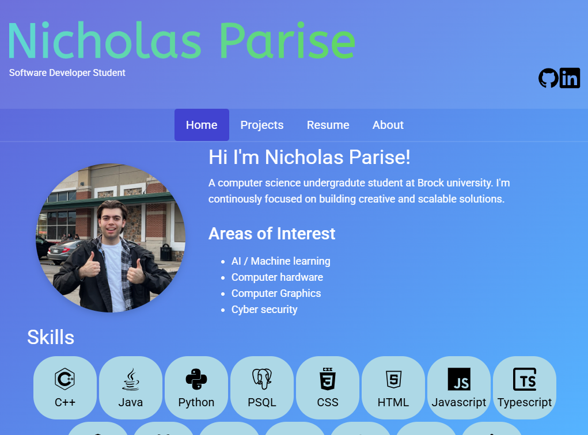

# My Portfolio

Well here's my portfolio you should go checkout the website: [nicholasparise.com](https://nicholasparise.com)

This website was created using Angular as a jumping off point for more complex projects. I've made websites before but never with a framework so learning how to do things the 'Angular way' was new to me. I'm not much of a front end dev as you can clearly see. As portfolios go it's very simple and bare bones but that's all I really need right now, it gets updated every time I complete a major project or have more work experience.

## Hosting
This website is hosted on a Oracle VPS, it uses NGINX and the files are served statically. This was also a jumping off point for [Wishify](https://github.com/Nicholas-Parise/4P02-course-project) where I was the sole backend developer for that project 

## Home page
